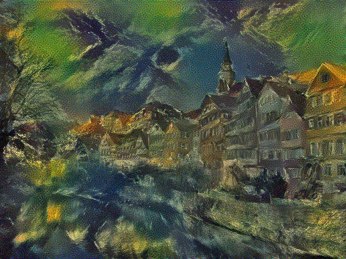
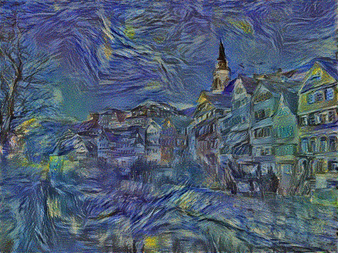
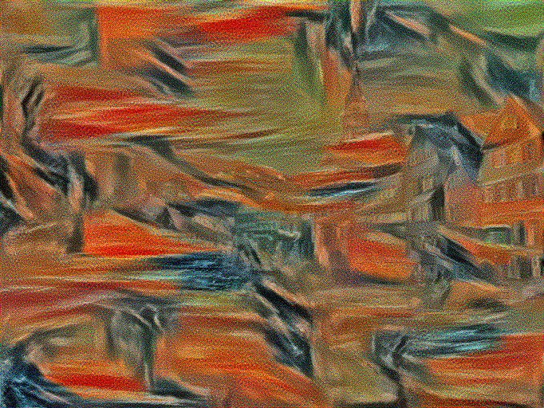
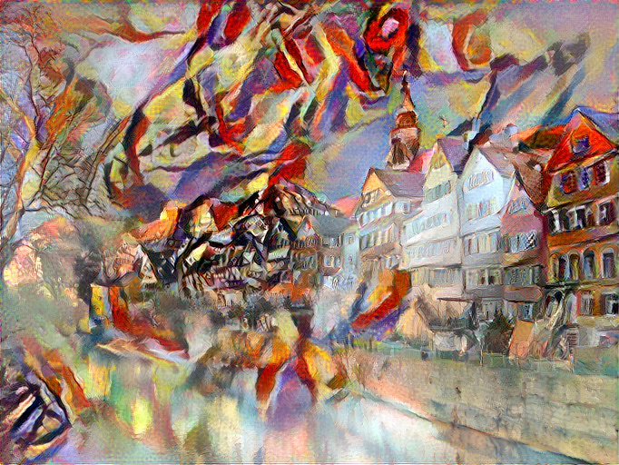
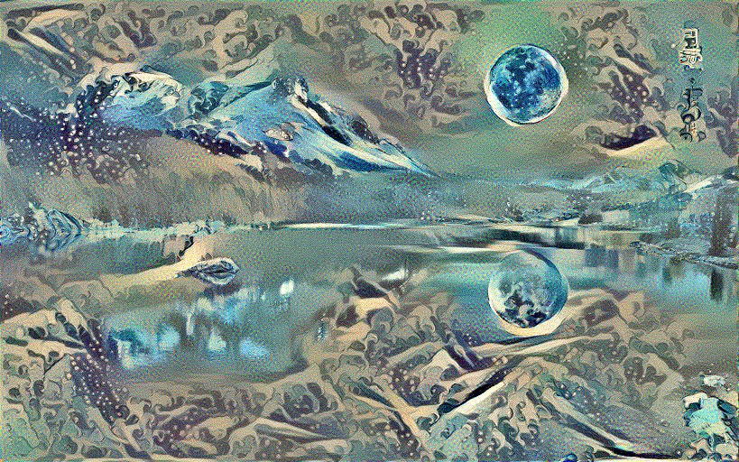
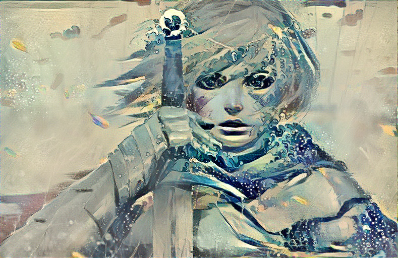

# Neural Style Transfer-TF&Keras (2019/05/20)

## Introduction
I implement a tensorflow&keras model described in the papers
- ["A Neural Algorithm of Artistic Style"](https://arxiv.org/pdf/1508.06576v2.pdf).
- ["Image Style Transfer Using Convolutional Neural Networks", CVPR 2016](https://www.cv-foundation.org/openaccess/content_cvpr_2016/papers/Gatys_Image_Style_Transfer_CVPR_2016_paper.pdf). by Leon A. Gatys, Alexander S. Ecker, Matthias Bethge

## Environment
- Ubuntu 16.04
- Python 3.6

## Depenency
- Numpy
- Opencv2
- Matplotlib
- Tensorflow (1.4 <= x <=1.13)

## Files
- `images(dir)` : images for style transfer.
- `neural_style_transfer.py` : main code for style transfer.
- `neural_style_transfer.ipynb` : you can execute this code on jupyternotebook. recommend 'Colab' of Google.

## How to use
#### Running
```
python neural_style_transfer.py --content_image_path <content image path> --style_image_path <style image path>
# ex)
python neural_style_transfer.py --content_image_path images/content/tubingen.jpg --style_image_path images/style/starry-night.jpg
```

#### Arguments
*Required* :  
- `--content_image_path`: Path of the content image. *Default*: `images/content/tubingen.jpg`
- `--style_image_path`: Path of the style image. *Default*: `images/style/starry-night.jpg`

*Optional* :  
- `--model_type`: Type of pretrained model. *Choices*: 0(VGG16), 1(VGG19) *Default*: `0`
- `--image_resize`: Resize(int or tuple) images. *Default*: `512`
- `--rescale_image`: Rescale the final image to original size. *Default*: `False`
- `--content_blocks`: Layer list for feature vector of Content image. *Default*: `['block4_conv2']`
- `--style_blocks`: Layer list for feature vector of Style image. *Default*: `['block1_conv1', 'block2_conv1', 'block3_conv1', 'block4_conv1', 'block5_conv1']`
- `--loss_ratio`: Weight of content-loss relative to style-loss. Alpha over beta in the paper. *Default*: `1e-3`
- `--total_variation_weight`: Total Variation weight. *Default*: `0 (If you want to use this, then 8.5e-5)`
- `--initial_type`: The initial image to generate image. *Choices*: content, style, random. *Default*: `'random'`
- `--optimizer_type`: The optimizer for optimization. *Choices*: 0(Adam Optimizer), 1(L-BFGS-B Optimizer). *Default*: `1`
- `--learning_rate`: The value of learning rate for Adam Optimizer. *Default*: `1e+1`
- `--beta_1`: Beta_1 of Adam Optimizer. *Default*: `0.9`
- `--beta_2`: Beta_2 of Adam Optimizer. *Default*: `0.999`
- `--epsilon`: Epsilon of Adam Optimizer. *Default*: `1e-08`
- `--iteration`: The number of iterations. *Default*: `150`

## Sample results
### Content Image : Tübingen, Germany
### Style Image : starry-night, seated-nude, shipwreck, kandinsky, the_scream
All of results made from default setting and executed on Colab.

<p align="center">







</p>

### Content Image : 
#### Female Knight ([source](https://www.artstation.com/artwork/4zXxW))

#### blue-moon-lake ([source](https://github.com/titu1994/Neural-Style-Transfer))

### Style Image : wave
All of results made from default setting and executed on Colab.

</p>
<p align='center'>


<br>

<br>


<br>

</p>


## Reference
#### https://github.com/anishathalye/neural-style.

#### https://github.com/titu1994/Neural-Style-Transfer

#### https://github.com/hwalsuklee/tensorflow-style-transfer

#### https://github.com/cysmith/neural-style-tf
